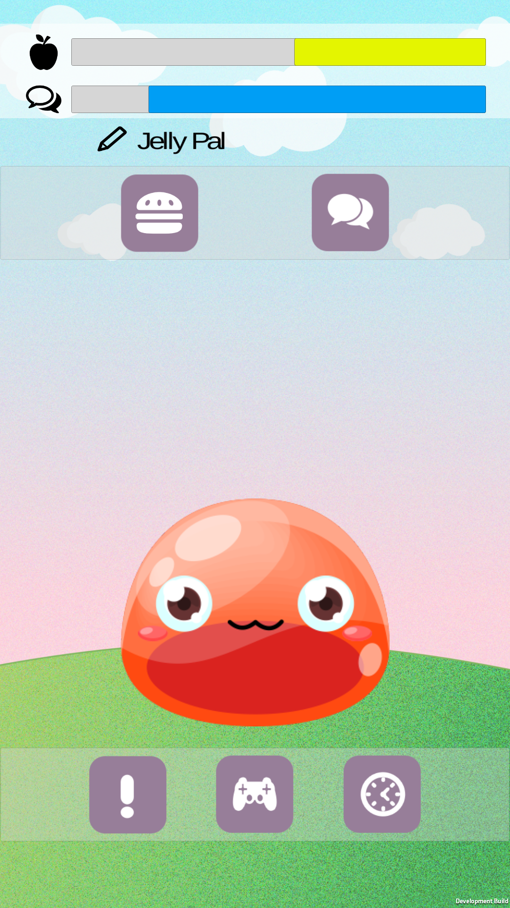

# Jelly Pal
Jelly Pal is an interactive friend who lives in your phone and helps manage your mental health. You can talk to your Jelly Pal and feed it, just like a real pet. Jelly Pal even has two games, a rhythm game to distract you and a breathing game to help deal with panic attacks. You can also schedule reminders so that the Jelly Pal will remind you when to take your medication.



## Libraries

This project was mostly completed using the native C# libraries and the built-in Unity libraries. The third-party libraries used for the more complex features and effects are as follows:

**Pixel Crushers Dialogue System for Unity:** A library that allows for building complex dialog trees in Unity. Different responses trigger different paths through the tree. Source [here](https://assetstore.unity.com/packages/tools/ai/dialogue-system-for-unity-11672)

**Hippo Simple Android Notifications:** Enables the use of local notifications in Android. Allows for customization of notification icon and colors. Source [here](https://assetstore.unity.com/packages/tools/integration/simple-android-notifications-free-68626)

**Moonflower Carnivore Jiggly Bubble Free:** A Unity particle effect package that contains various bubble animations. Source [here](https://assetstore.unity.com/packages/vfx/particles/environment/jiggly-bubble-free-61236)

**Full Tilt Boogie Starter Particle Pack:** A customizable Unity particle effect package that contains explosion and ambient animations with textures. Source [here](https://assetstore.unity.com/packages/vfx/particles/starter-particle-pack-83179)

## Installation Notes
**Requirements**
- Unity with Android Support
- Android SDK

**Steps to Install**
1. Download the project .zip file from [github](https://github.com/rebeccaansems/CSCI-4176) and unzip it
2. Open the project in Unity
3. Go to File>Build Settings
4. Ensure all scenes are checked
5. Under the 'Android' tab (near the bottom of the window)...
    - Ensure 'Build System' is set to 'Internal'
    - Click 'Build'
    - The save window that appears is where you will save the Android APK
    - NOTE: If you have already configured Unity to point to the Android SDK, the app will build after you save the APK. If not, the next window will be where you select the folder the Android SDK is saved in.
6. The project will build and the APK will be saved in the location you specified.
7. To run the APK on your phone, you can either 'File>Build and Run' with your phone plugged into the computer or you can transfer the APK to your phone and install it as you would any app.
8. (Optional) If you want to run from the Unity player, it is helpful to change the aspect ratio to 'WXGA Portrait (800x1280)' to imitate an Android screen (though some aspects of the app may behave incorrectly using this method of testing)


## Code Examples

**Problem 1: We needed a method to find the inactive Gameobjects**

In general, we can control the activation of gameobject with *Gameobject.find*. However, if you set the Gameobjects up as inactive ones, you cannot find the objects with *Gameobject.find*. There are many ways to solve this problem, but we used the parents Gameobject and *GetComponentsInChildren<Transform>*.

```
void Start() {
    gameObjectArray1 = GameObject.FindGameObjectsWithTag ("Buttons");
    tmpObject = GameObject.FindGameObjectWithTag ("TestButtons");
    allChildren = tmpObject.GetComponentsInChildren<Transform>(true);
}

public void ChangeButton(bool buttonGroup) {
    foreach (GameObject go in gameObjectArray1) {
        go.SetActive (false);
    }
    foreach (Transform child in allChildren) {
        child.gameObject.SetActive (true);
    }
}
    
// Source: Unity Community [16]
```

**Problem 2: Codes for reading the breathing data from the mic**

In Panic Attack activity we needed to get the status of user’s breathing. 
This is done using an audio listener on the microphone which plays back the audio is records. Playback of the audio resulted in a feedback loop with the microphone as it picked up the playback sound of what it just read.
Therefore we used a muted audio listener then controlled the animation with the breathing time.

```
void Update(){
    //Get normalized readings from the mic
    float[] samples = GetAudioSamples(audioSource);
    //Get their average volume
    float average = AverageVolume(samples);
    bubbleTime -= Time.deltaTime;

    if (average > 0.003F){
        if (bubbleTime <= 0.0f){
            //Restart bubble animation timeout
            bubbleTime = 1.0f;
            //Show bubbles
            bubbles.Play(true);
        }
        if (isVisible(jellyPal)){
            //Float Jelly up
            jellyPal.transform.Translate(0F, 0.05F, 0F);
        }
    } 
    else{
        if (bubbleTime <= 0.0f){
            bubbles.Stop(true);
        }
        //Sink back down
        if (jellyPal.transform.position.y > baseLevel){
            jellyPal.transform.Translate(0F, -0.01F, 0F);
        }
    }
}
```

**Problem 3: Moving the beats in time in the Rhythm Game**

It was hard to sync the music notes with the music correctly. Tracking the time passed since the song started can result in slowly thrown off beat timing. 
This was done by finding beats per second divided by frames per second), see the init of the song player.

```
void Update(){
    // Remove the beat if it has been missed
    if (SongPlayer.beatTime > (songBeatPosition + BUFFER_TIME)){
        beatFeedback.text = "MISS";
        SongPlayer.missed += 1;
        Destroy(gameObject);
    }
    // The step function linearly approaches an asymptote at 1
    step = (beatInitAdvance - (songBeatPosition - SongPlayer.beatTime)) / beatInitAdvance;
    transform.position = Vector2.Lerp(startPoint, endPoint, step);
}

// Source: Gamasutra.com [15]
```
    
## Feature Section
* Rhythm Game - To help the player deal with anxiety our rhythm game distracts the player by having them focus on tapping on small stars at very precise moments.
* Microphone Game - To help the player deal with panic attacks our microphone game visually rewards the player for blowing into the microphone in such a way that has been studied to help with releaving panic attacks.
* Medication Scheduling - To help remind the player to take their medications at the correct times their is a scheduling system so the player can set what medication, and what times/dates they need to take said medication. Notifications are sent when the player needs to take said medication.
* Dialog System - To give the player "someone" to talk to we implemented a chat tree style dialog system so that the player can "talk" to the jelly.
* Environment Effects - The background of the jelly changes dependent on time and weather of the location of the player.

## Final Project Status
The final version of our project has achieved all out expected goals. We have some games, some chat functionality, and scheduling. However for this project to be released more work should be done. Jelly Pal would benefit from the interactivity of many of the bonus functionality. The most important next step for the project would be to improve the chat feature to have chatbot functionality. Bonding with the jelly is the key idea this application is built around and improved chatting would benefit that.

#### Minimum Functionality
- Home screen (Completed)
- Tracking interactions (Completed)
- Microphone based game (Completed)
- Basic dialog (Completed)
- Notifications (Completed)

#### Expected Functionality
- Calendar (Completed)
- Rhythm game (Completed)
- Reactions (Completed)
- Responses (Completed)

#### Bonus Functionality
- Environment effects (Completed)
- Additional games (Not Implemented)
- Bluetooth connectivity (Not Implemented)
- Chatbot level interaction (Not Implemented)

## Sources
[1] “Apple black silhouette with a leaf free icon”, www.flaticon.com, 2018. [Online]. Available: [https://www.flaticon.com/free-icon/apple-black-silhouette-with-a-leaf_46504#term=food&page=1&position=45](https://www.flaticon.com/free-icon/apple-black-silhouette-with-a-leaf_46504#term=food&page=1&position=45).

[2] “Comments free icon”, www.flaticon.com, 2018. [Online]. Available: [https://www.flaticon.com/free-icon/comments_25360#term=talking&page=1&position=4](https://www.flaticon.com/free-icon/comments_25360#term=talking&page=1&position=4).

[3] RainbowArt, “5000 Flat Buttons Pack”, assetstore.unity.com, 2018. [Online]. Available: [https://assetstore.unity.com/packages/2d/gui/icons/5000-flat-icons-buttons-pack-37251](https://assetstore.unity.com/packages/2d/gui/icons/5000-flat-icons-buttons-pack-37251).

[4] “JELLY SQUASH FREE SPRITES”, GameArt2D.com, 2018. [Online]. Available: [https://www.gameart2d.com/jelly-squash-free-sprites.html](https://www.gameart2d.com/jelly-squash-free-sprites.html).

[5] “God Save Us - Instruments”, www.looperman.com, 2017. [Online]. Available: [https://www.looperman.com/loops/detail/116808/god-save-us-instruments-by-monstera-free-120bpm-classical-fx-loop](https://www.looperman.com/loops/detail/116808/god-save-us-instruments-by-monstera-free-120bpm-classical-fx-loop).

[6] Dog Eat Dog Games, “Audio Visualizer”, assetstore.unity.com, 2018. [Online]. Available: [https://assetstore.unity.com/packages/tools/audio/audio-visualizer-47866](https://assetstore.unity.com/packages/tools/audio/audio-visualizer-47866).

[7] Hippo, "Simple Android Notifications Free”, assetstore.unity.com, 2018. [Online]. Available: [https://assetstore.unity.com/packages/tools/integration/simple-android-notifications-free-68626](https://assetstore.unity.com/packages/tools/integration/simple-android-notifications-free-68626).

[8] Moonflower Carnivore, "Jiggly Bubble Free”, assetstore.unity.com, 2017. [Online]. Available: [https://assetstore.unity.com/packages/vfx/particles/environment/jiggly-bubble-free-61236](https://assetstore.unity.com/packages/vfx/particles/environment/jiggly-bubble-free-61236).

[9] “Hamburger Meal free icon”, www.flaticon.com, 2018. [Online]. Available: [https://www.flaticon.com/free-icon/hamburger-meal_72341#term=burger&page=1&position=60](https://www.flaticon.com/free-icon/hamburger-meal_72341#term=burger&page=1&position=60).

[10] Grapes, “Another one”, ccmixter.org, 2009. [Online]. Available: [http://ccmixter.org/files/grapes/19168](http://ccmixter.org/files/grapes/19168).

[11] Pixel Crushers, "Dialogue System for Unity”, assetstore.unity.com, 2018. [Online]. Available: [https://assetstore.unity.com/packages/tools/ai/dialogue-system-for-unity-11672](https://assetstore.unity.com/packages/tools/ai/dialogue-system-for-unity-11672).

[12] A. Pantera, "Background Night”, opengameart.org, 2015. [Online]. Available: [https://opengameart.org/content/background-night](https://opengameart.org/content/background-night).

[13] FullTiltBoogie, "Starter Particle Pack”, assetstore.unity.com, 2017. [Online]. Available: [https://assetstore.unity.com/packages/vfx/particles/starter-particle-pack-83179](https://assetstore.unity.com/packages/vfx/particles/starter-particle-pack-83179).

[14] Écrivain, "Star”, opengameart.org, 2010. [Online]. Available: [https://opengameart.org/content/star](https://opengameart.org/content/star).

[15] Y. Chao, "Music Syncing in Rhythm Games”, gamasutra.com, 2017. [Online]. Available: [https://www.gamasutra.com/blogs/YuChao/20170316/293814/Music_Syncing_in_Rhythm_Games.php](https://www.gamasutra.com/blogs/YuChao/20170316/293814/Music_Syncing_in_Rhythm_Games.php).

[16] Unity Answers, "Set Objects Child to Active/Inactive(Solved)”, 2015. [Online]. Available: [https://answers.unity.com/questions/894211/set-objects-child-to-activeinactive.html](https://answers.unity.com/questions/894211/set-objects-child-to-activeinactive.html).

[17] OpenWeatherMap, "Weather API", 2018. [Online]. Available: [http://openweathermap.org/api](http://openweathermap.org/api).
